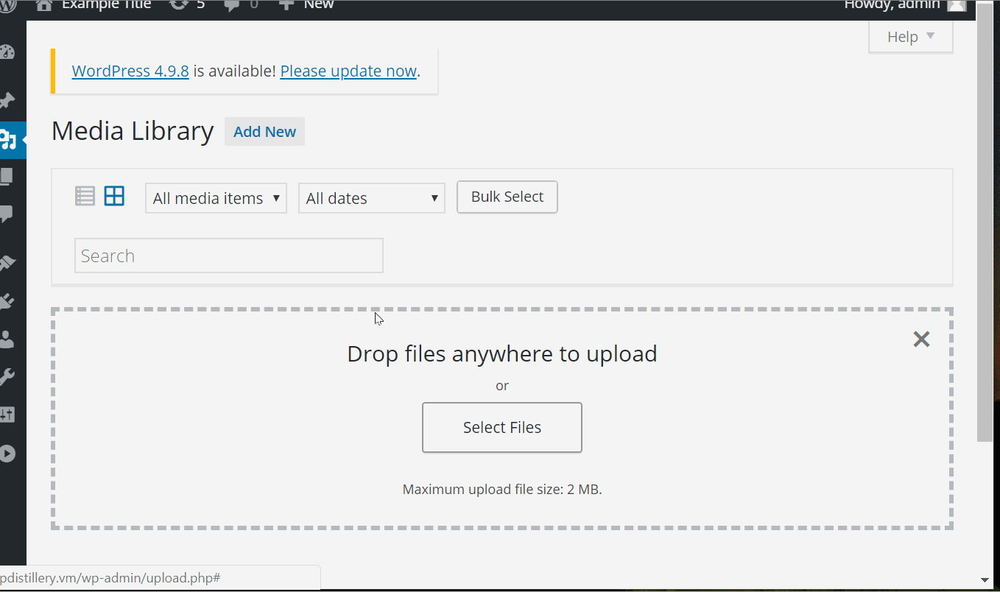
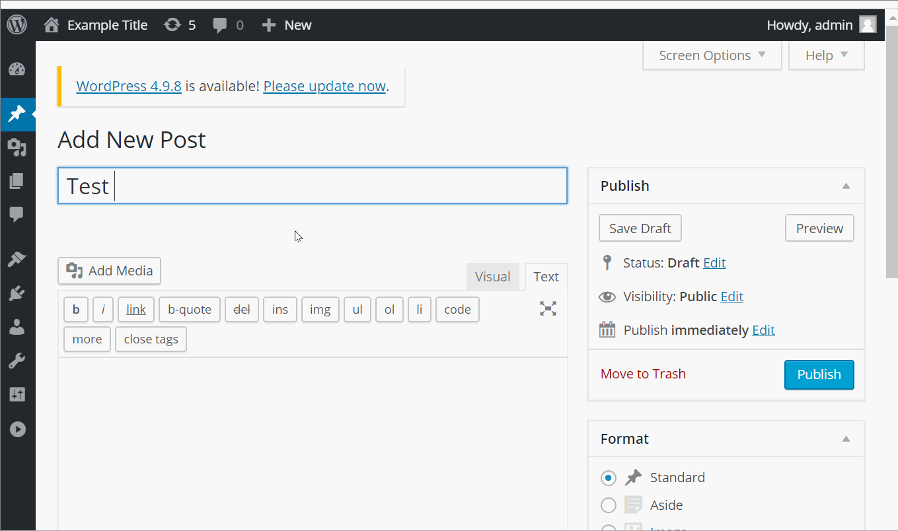
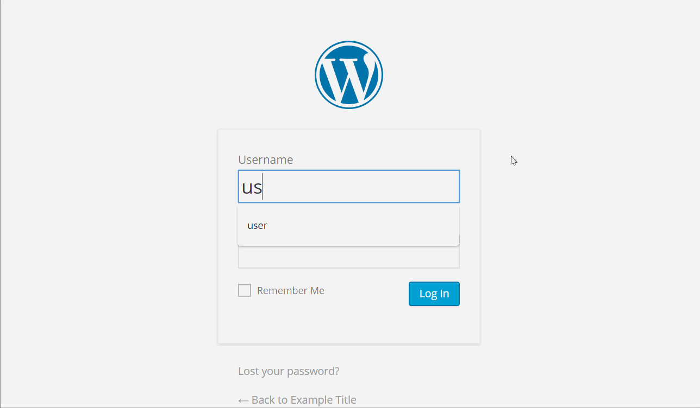

# Project 7 - WordPress Pentesting

Time spent: 6 hours spent in total

> Objective: Find, analyze, recreate, and document **three vulnerabilities** affecting an old version of WordPress

## Pentesting Report

1. Media Page (XSS)
  - [X] Summary: 
    - Vulnerability types:XSS
    - Tested in version:4.2
    - Fixed in version: 4.6.1
  - [X] GIF Walkthrough:
        
  - [X] Steps to recreate: Upload an new image and update the title name to ```filename.png```. Then view attachment page which should then bring up an onerror message.
  - [X] Affected source code:
    - [Wordpress v4.2](https://core.trac.wordpress.org/browser/branches/4.2/src/wp-admin/includes/media.php)

2. New Post (XSS)
  - [X] Summary: 
    - Vulnerability types:XSS
    - Tested in version: 4.2
    - Fixed in version: 4.6
  - [X] GIF Walkthrough: 
        
  - [X] Steps to recreate: Create a new post and write in the text box ```<a onmouseover= "alert('test') >click here</a>```. When previewing the page, mouse over the text which then displays a message 'test' as a pop up. 
  - [X] Affected source code:
    - [Wordpress v4.2](https://core.trac.wordpress.org/browser/tags/version/src/source_file.php)
    
3. Login Page (User Enumeration)
  - [X] Summary: 
    - Vulnerability types: User Enumeration
    - Tested in version: 4.2
    - Fixed in version: 4.7.5
  - [X] GIF Walkthrough:
        
  - [X] Steps to recreate: Using the login screen, check for any user with any password. After check for the user admin with any                     password. The errors are not the same since it shows admin is a valid username. Using this information, guess the password               for user admin. 
  - [X] Affected source code:
    - [Wordpress v4.2](https://core.trac.wordpress.org/browser/branches/4.2/src/wp-includes/class-wp-editor.php?rev=33361)

## Assets

List any additional assets, such as scripts or files

## Resources

- [WordPress Source Browser](https://core.trac.wordpress.org/browser/)
- [WordPress Developer Reference](https://developer.wordpress.org/reference/)

GIFs created with [LiceCap](http://www.cockos.com/licecap/).

## Notes

Describe any challenges encountered while doing the work

## License

    Copyright [2018] [Matthews Cardenas]

    Licensed under the Apache License, Version 2.0 (the "License");
    you may not use this file except in compliance with the License.
    You may obtain a copy of the License at

        http://www.apache.org/licenses/LICENSE-2.0

    Unless required by applicable law or agreed to in writing, software
    distributed under the License is distributed on an "AS IS" BASIS,
    WITHOUT WARRANTIES OR CONDITIONS OF ANY KIND, either express or implied.
    See the License for the specific language governing permissions and
    limitations under the License.
